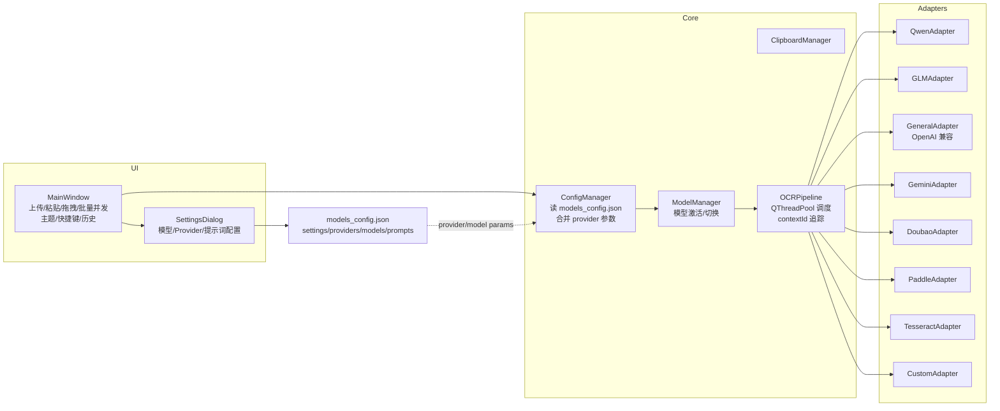
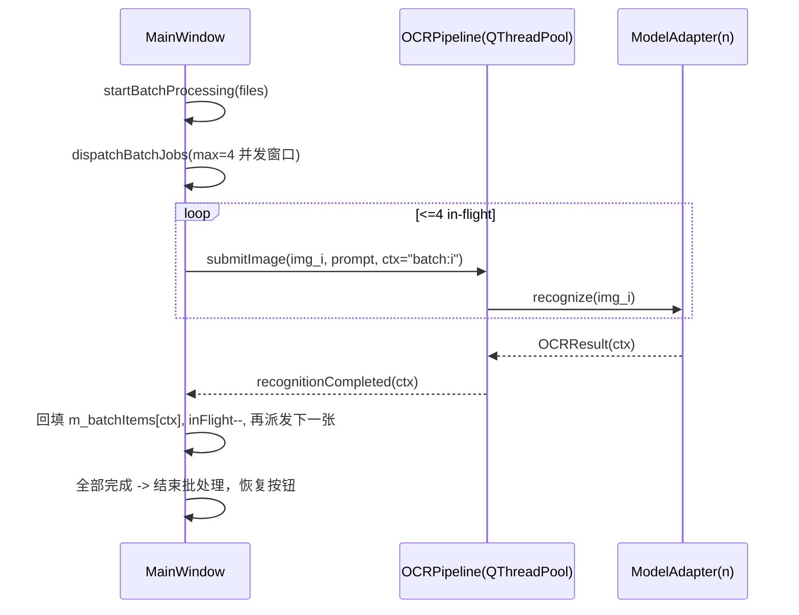

# 技术架构：为开发者而生
架构示意图

mermaid 预览：[Mermaid Live Editor](https://mermaid.live/)



并发处理示意图




## 核心组件目录

```
XS-VLM-OCR/
├── src/core/              # 核心引擎
│   ├── ModelAdapter.h     # 模型适配器接口（抽象）
│   ├── OCRPipeline.cpp    # 识别流水线（线程池调度）
│   └── OCRResult.h        # 结果结构定义（含 contextId）
├── src/adapters/          # 模型适配器
│   ├── QwenAdapter.cpp    # 通义千问
│   ├── GLMAdapter.cpp     # 智谱 GLM
│   ├── TesseractAdapter.cpp # Tesseract（离线）
│   ├── PaddleAdapter.cpp  # PaddleOCR-VL
│   ├── GeneralAdapter.cpp # OpenAI 兼容（gen）
│   ├── GeminiAdapter.cpp  # 谷歌 Gemini
│   ├── DoubaoAdapter.cpp  # 字节豆包 Ark
│   └── CustomAdapter.cpp  # 自定义/本地 API
├── src/managers/          # 管理组件
│   ├── ModelManager.cpp   # 模型管理/激活
│   └── ClipboardManager.cpp # 剪贴板管理
├── src/utils/             # 工具类
│   └── ConfigManager.cpp  # 配置管理（加载/合并 provider）
└── src/ui/                # 用户界面
    ├── MainWindow.cpp     # 主窗口（首页/批量/快捷键/主题）
    └── SettingsDialog.cpp # 设置对话框（模型、提示词配置）
```

## 核心功能速览
- 多模型/多模态：内置多家在线模型 + Tesseract/Paddle，支持 OpenAI 兼容接口。
- 批量并发：多图上传/拖拽，默认 4 并发，结果按 contextId 回填，可左右箭头切换查看。
- 快速输入：上传、粘贴、拖拽、截图快捷键；历史记录、自动复制/保存/识别。
- 主题与布局：明暗主题、侧栏可拖拽，批量导航与关闭按钮随主题切换。
- 统一配置：`models_config.json` 管理全局设置、provider、模型清单、提示词模板。

## 识别链路与并发（必看）

### 1 识别流水线（`src/core/OCRPipeline.*`）
- 提交：`submitImage(image, source, prompt, contextId)` → `recognitionStarted` 信号。
- 线程池：使用 `QThreadPool::globalInstance()`，`OCRTask` 继承 `QRunnable` 运行 `ModelAdapter::recognize`。
- 结果：`OCRResult` 含 `contextId`，完成/失败信号带回 `contextId`，UI 用它定位对应任务。
- 并发数（线程池层）：默认由 Qt 控制，如需限制可在构造中 `m_threadPool->setMaxThreadCount(N)`。

### 2 批处理调度（`src/ui/MainWindow.cpp`）
- 并发窗口：`kMaxBatchConcurrent`（头文件常量，默认 4）。
- 流程：`startBatchProcessing` 构造队列 → `dispatchBatchJobs` 在 in-flight < 并发窗口时派发，`contextId="batch:<idx>"`。
- 回填：`onRecognitionCompleted/Failed` 解析 `contextId`，写回 `m_batchItems[idx]`，`m_batchInFlight--`，继续派发。
- 结束：队列提交完且 in-flight 为 0 → 批处理结束，恢复按钮状态。

## 配置文件要点（`models_config.json`）
- `settings`：全局行为（自动复制/保存/识别、快捷键等）。
- `providers`：统一 API Key/Host，示例：`aliyun`、`glm`、`paddle`、`gen`、`gemini`、`doubao`。
- `models`：模型清单，每项包含
  - `id`/`displayName`/`enabled`
  - `engine`（tesseract/qwen/glm/paddle/gen/gemini/custom/…）
  - `provider`（可为空，使用 provider 统一 Key/Host）
  - `params`（`model_name`、`api_host`、`api_key`、`temperature` 等，适配器自定义）
- `prompt_templates`：提示词模板（按类型/分类）。

## 二次开发

### 新增一个模型适配器
1. 复制现有适配器作为模板（如 `GeneralAdapter`），实现 `initialize()`/`recognize()`。
2. 在 `CMakeLists.txt` 注册源文件。
3. 在 `MainWindow.cpp` 引擎分支创建你的适配器；在 `SettingsDialog.cpp` 添加引擎/Provider 下拉项。
4. 在 `models_config.json` 添加示例模型（配置 provider、model_name、api_host、api_key）。

**示例：接入“FooAI” OpenAI 兼容接口**
- 新建 `FooAdapter` 继承 `GeneralAdapter` 或直接用 `engine: "gen"`。
- `models_config.json` 中添加：
  ```json
  {
    "id": "fooai_vision",
    "displayName": "FooAI-Vision",
    "type": "online",
    "engine": "gen",
    "provider": "",
    "enabled": false,
    "params": {
      "deploy_type": "online",
      "model_name": "fooai-vision-pro",
      "api_host": "https://api.fooai.com",
      "api_key": "sk-xxxx",
      "temperature": "0.1"
    }
  }
  ```
- `SettingsDialog.cpp` 的引擎下拉无需改（用 `gen`）；如需 Provider 统一 Key，可在 `providers` 增加 `fooai`，并在下拉添加一项。
- 如需单独适配器（自定义 host/path），可以最小改动继承 GeneralAdapter：
  ```cpp
  // src/adapters/FooAdapter.h
  #pragma once
  #include "GeneralAdapter.h"
  class FooAdapter : public GeneralAdapter {
  public:
      explicit FooAdapter(const ModelConfig& c, QObject* p=nullptr)
        : GeneralAdapter(c, p) {}
  };

  // MainWindow.cpp 引擎分支
  else if (config.engine == "foo") {
      adapter = new FooAdapter(config, this);
  }
  ```
  在 `models_config.json` 设置 `"engine": "foo"` 即可。

### 接入一个新 Provider（OpenAI 兼容）
1. 若兼容 OpenAI 格式，直接在 `models_config.json` 添加 provider 与模型，使用 `engine: "gen"`（GeneralAdapter）。
2. 若非兼容，创建新适配器或参考 `DoubaoAdapter`、`GeminiAdapter` 自定义请求/响应结构。

**示例：添加 Provider “barcloud”**
- `models_config.json` → `providers` 增加：
  ```json
  "barcloud": {
    "api_host": "https://api.barcloud.com/v1",
    "api_key": "",
    "description": "BarCloud OpenAI 兼容接口",
    "name": "BarCloud"
  }
  ```
- `SettingsDialog.cpp` Provider 下拉添加 BarCloud 选项。
- 新模型直接引用 `provider: "barcloud"`，无需重复填 host/key。
- 代码挂接（`SettingsDialog.cpp`）：`m_providerCombo->addItem("BarCloud (OpenAI兼容)", "barcloud");`

### 调整并发
- UI 批量并发：改 `MainWindow.h` 的 `kMaxBatchConcurrent`。
- 线程池并发：在 `OCRPipeline` 构造中调用 `m_threadPool->setMaxThreadCount(N)`。

**示例：将批量并发改为 8，线程池限制为 6**
- `MainWindow.h`：`static constexpr int kMaxBatchConcurrent = 8;`
- `OCRPipeline::OCRPipeline`：取消注释 `m_threadPool->setMaxThreadCount(6);`
- 代码片段：
  ```cpp
  // MainWindow.h
  static constexpr int kMaxBatchConcurrent = 8;

  // src/core/OCRPipeline.cpp
  OCRPipeline::OCRPipeline(QObject* parent)
    : QObject(parent), m_currentAdapter(nullptr),
      m_threadPool(QThreadPool::globalInstance()) {
      m_threadPool->setMaxThreadCount(6);
  }
  ```

### UI/主题调整
- 样式集中在 `applyTheme`；批量箭头、关闭按钮有明暗两套样式。
- 侧栏宽度可拖拽（`QSplitter`），导航按钮/提示词区在 `MainWindow.cpp`。

**示例：为上传按钮在暗色主题下增加高亮色**
- 在 `applyTheme` 中暗色分支的 `mainBtnStyle` 调整 background/border 为品牌色。
  ```cpp
  QString mainBtnStyle = grayTheme
    ? "QPushButton { padding:12px 24px; color:#fff; background:#1e88e5; border:1px solid #42a5f5; border-radius:8px; }"
    : "QPushButton { padding:12px 24px; color:#333; background:#f5f5f5; border:1px solid #e0e0e0; border-radius:8px; }";
  m_uploadBtn->setStyleSheet(mainBtnStyle);
  m_pasteBtn->setStyleSheet(mainBtnStyle);
  ```

### 日志与诊断
- 使用 `qDebug()/qWarning()` 已遍布核心链路；需要请求/响应抓取可在适配器里增加日志或存档。

**示例：记录调用耗时与响应**
- 在适配器 `recognize` 中用 `QElapsedTimer` 记录；将 payload/resp 片段写入 `qDebug()` 或文件（注意脱敏 API Key）。
  ```cpp
  QElapsedTimer timer; timer.start();
  QString content = callAPI(imageBase64, prompt, hasImage, errorMsg);
  qDebug() << "FooAdapter cost(ms)" << timer.elapsed()
           << "resp size" << content.size();
  ```

### 结果导出扩展示例
- 增加 Markdown 导出按钮（最小改动思路）：
  ```cpp
  // MainWindow.h 新增: QPushButton* m_exportMdBtn;
  // MainWindow.cpp: 在结果按钮区域创建并连接
  m_exportMdBtn = new QPushButton("导出MD");
  resultHeaderLayout->addWidget(m_exportMdBtn);
  connect(m_exportMdBtn, &QPushButton::clicked, [this](){
      QString path = QFileDialog::getSaveFileName(this,"导出为 Markdown","result.md","*.md");
      if(path.isEmpty()) return;
      QFile f(path);
      if(f.open(QIODevice::WriteOnly|QIODevice::Truncate))
          f.write(m_resultText->toPlainText().toUtf8());
  });
  ```

### 输入来源扩展示例
- 监听文件夹自动入队（伪代码）：
  ```cpp
  // 定时扫描目录，将新图片路径加入 QVector<QString> pending;
  if (!pending.isEmpty()) {
      startBatchProcessing(pending, SubmitSource::Upload);
      pending.clear();
  }
  ```

## 构建与运行

### 1. 克隆与生成构建目录
```
git clone <your_repo> XS-VLM-OCR
cd XS-VLM-OCR
mkdir build && cd build
```

### 2. Windows 编译（MinGW 示例）
```
cmake .. -DCMAKE_BUILD_TYPE=Release ^
         -DCMAKE_PREFIX_PATH="C:/Qt/Qt5.14.2/5.14.2/mingw73_32"
cmake --build . --config Release -j8
```
> 如使用 MSVC，CMAKE_PREFIX_PATH 指向 msvc 版 Qt；或选择对应生成器（Visual Studio）。

### 3. Linux 编译（Debian/Ubuntu 示例）
安装依赖：
```
sudo apt-get install -y build-essential cmake qtbase5-dev qttools5-dev-tools \
    libqt5svg5-dev libtesseract-dev libleptonica-dev
```
构建：
```
mkdir -p build && cd build
cmake .. -DCMAKE_BUILD_TYPE=Release
cmake --build . -j$(nproc)
```

### 4. 运行与打包
- 运行：`./XS-VLM-OCR`（Windows 下在 build 目录运行可执行文件）。
- 若缺少 Qt 动态库，使用 `windeployqt.exe <exe>` 自动复制依赖到同目录。
- 如提示缺少 OpenSSL，将 Qt 自带或系统安装的 `libssl-1_1`/`libcrypto-1_1` 放入可执行文件目录或加入 PATH。

### 5. 关键配置
- 运行前确保同级目录有 `models_config.json`（可用仓库自带模板）。
- Tesseract 路径：在配置中设置 `path`（Windows 常为 `C:/Program Files/Tesseract-OCR/tesseract.exe`；Linux 为 `/usr/bin/tesseract`）。
- Provider/API Key：在 `models_config.json` 或 Settings 界面填入（支持阿里/智谱/Gemini/通用 gen/豆包等）。

### 6. 常见问题
- 找不到 Qt 动态库：检查 PATH 或使用 `windeployqt`。
- TLS/SSL 缺失：放置/配置 OpenSSL 1.1.1 动态库。
- 生成器不符：CMake 重新配置时选择正确的编译器（MinGW/MSVC/Ninja/Makefile）。

## 代码速记
- UI/入口：`MainWindow.cpp`（首页/批量/快捷键/主题），`SettingsDialog.cpp`（模型与提示词配置）。
- 识别链路：`OCRPipeline.*`（线程池），`OCRResult.h`（结果结构+contextId），`ModelAdapter.h`（接口）。
- 适配器：`src/adapters/`（在线/离线模型）。
- 配置/管理：`ConfigManager.cpp`，`ModelManager.cpp`。

## FAQ
- 并发数怎么调？`MainWindow.h` 的 `kMaxBatchConcurrent`；限制线程池则在 `OCRPipeline` 构造中设置 `setMaxThreadCount(N)`。
- 如何加新模型？新建适配器 → 注册引擎 → 设置页下拉 → 示例配置。
- UI 样式不符？看 `applyTheme`，为控件单独设置明暗样式，必要时排除通用样式覆盖。
- 配置怎么管理？都在 `models_config.json`：provider 统一 Key/Host 下发到模型，提示词模板同文件分发。